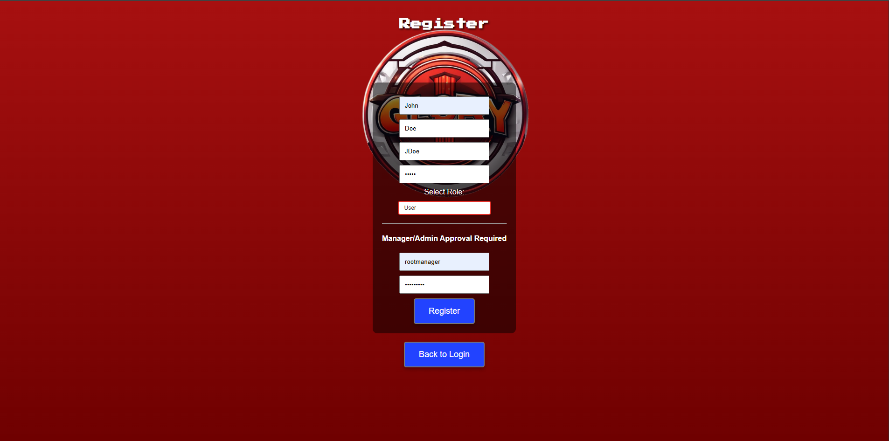

# CSC289 Programming Capstone Project

**Project Name**: Glory Days Inventory System  
**Team Number**: 5  
**Team Project Manager**: Devin McLoughlin  
**Team Members**: Ryan David McWhirt, Terry Wiggins, Anthony De Casas Mata, Thomas Coates

---

## Glory Days Inventory System User Manual

---

### Introduction

The Glory Days Inventory System is a software application developed for Glory Days, a small retail store that specializes in buying and reselling video games. The purpose of this system is to assist employees and managers with inventory tracking, employee account management, and sales processing. This guide is intended for both store employees and managers who will use the application in day-to-day operations.

---

### Getting Started

#### System Requirements

- Operating System: Windows 10 or later  
- Python 3.10+ installed

#### Setup Instructions

1. Ensure that Python is properly installed on your system.  
2. Clone or download the project files to your local machine.  
3. Ensure that the database file `login_database.db` and `inventory.db` are present in the same directory as the main application script.  
4. Launch the application by running the main Python file `app.py` located within the `src` folder using your preferred method.

---

### Features Overview

The application includes the following core functionalities:

- Employee and Manager registration and login  
- Inventory management (add, update, delete, search)  
- Sale tracking and inventory adjustments  
- Administrative control panel for managers  
- Sales reporting and PDF export

---

### Using the Glory Days Inventory System

---

#### Registering an Employee Account

1. A manager must be present to oversee your registration.  
2. From the login page, click the **Register** button.

3. On the registration screen, enter your:
   - First Name  
   - Last Name  
   - Employee ID (format: First initial + Last name, e.g., JDoe)  
   - Password (provided by the manager but for testing purposes can be made up)  
4. Select **User** as the role.  
5. The assisting manager must enter their admin ID and password to approve your registration.
   - For the sake of demonstating and testing the application, a root manager account has been created. For the admin ID enter "rootmanager" and for the password enter "rmanager1"
6. Click **Register** to complete the process. You will be redirected to the login page.

---

#### Logging Into Your Account

1. Enter your Employee ID and Password on the login page.  
2. Click **Login**.  
3. If the credentials are valid, you'll be redirected to the main inventory interface.

---

#### Adding Inventory Items

1. After logging in, you will be directed to the inventory page.  
2. To add a new game, click the **Add Item** button.

4. Fill in the following fields:
   - **Name**: Enter the exact game title as printed.  
   - **Platform**: Choose from PlayStation, Xbox, PC, Switch, or Other.  
   - **Packaging**: Check if the game includes its original case.  
   - **Quality**: Choose one:
     - Good – Brand new in original case  
     - Like New – Light wear and minor scratches  
     - Old – Worn but functional  
     > Do not add broken or non-functioning games.
   - **Stock**: Quantity of this game to add  
   - **Price**: Enter the price per item  
5. Click **Add** to submit the game into inventory.

---

#### Searching Inventory

Use the search bar at the top of the inventory page to locate games by name or SKU. This allows for quick access when editing, selling, or verifying inventory.

---

#### Removing Inventory Items

If an item was added in error:

1. Click the **Delete** button next to the item.  
2. Confirm the deletion by typing **Delete** in the popup box.  
3. Click **OK** to remove the item from the system.

> **Note:** This is not the same as processing a sale. Use the **Sell** function to record sales.

---

#### Processing a Sale

1. Locate the item using the search bar.  
2. Click the red **Sell** button.  
3. Enter:
   - **Quantity**: Number of copies being sold  
   - **Sale Price**: (Optional) Adjust only if a discount is applied

   > Note that the sale price is per game copy. The application will automatically adjust the price with the quantity being sold.
4. Click **Submit** to finalize the transaction.

---

### Manager Functions

---

#### Registering as a Manager

1. Navigate to the registration page.  
2. Fill in your personal details.  
3. Select **Admin** from the role dropdown.  
4. Another manager must confirm your registration with their credentials.

---

#### Managing Employees

1. Click the **Admin** button in the top right corner of the main screen.  
2. In the Admin Panel, view all registered employees.  
3. To remove an employee, click **Delete** next to their name.  
4. Confirm the deletion.

> **Caution:** Do not delete your own account. You will need a fellow manager to re-register you.

---

#### Viewing Sales

1. Access the Admin Panel.  
2. Click the **View Sales** button.

4. Review the sales history, which includes game titles, quantities sold, and prices.  
5. Use the **Save as PDF** button to export a copy of the report.

---

#### Setting Up New Employees

As a manager, you are responsible for onboarding new staff:

1. Welcome the new employee.  
2. Guide them to the registration page.  
3. Provide their Employee ID and password.  
4. Authorize their registration with your admin credentials.  
5. Walk them through the inventory system and this user manual.

---

### Troubleshooting

| Issue                            | Solution                                                                 |
|----------------------------------|--------------------------------------------------------------------------|
| Can't log in                     | Double-check your Employee ID and password. Contact a manager if needed.|
| Add button not responding        | Ensure all required fields are filled correctly.                         |
| Can't delete item                | You must type **Delete** exactly when prompted.                          |
| Manager access denied            | Ensure your role is set to **Admin** and registration was approved.      |

---

### Frequently Asked Questions (FAQs)

**Q: What if I forget my password?**  
A: Contact a manager to reset your credentials.

**Q: Can I undo a sale?**  
A: Currently, sales are final. Contact a manager for correction procedures.

**Q: What if a game doesn’t match platform options?**  
A: Use the **Other** category.

**Q: what if the inventory is not displaying?**  
A: Ensure that files were downloaded correctly, redownload if necessary.

---

### Support and Contact Information

For technical support or application issues, please contact:

- **Email**: [dtmcloughlin@my.waketech.edu](mailto:dtmcloughlin@my.waketech.edu)  
- **Documentation**: All documentation can be found in the `docs` folder within the repository or, if downloaded, in your ZIP folder 

---

*Thank you for using the Glory Days Inventory System.*
